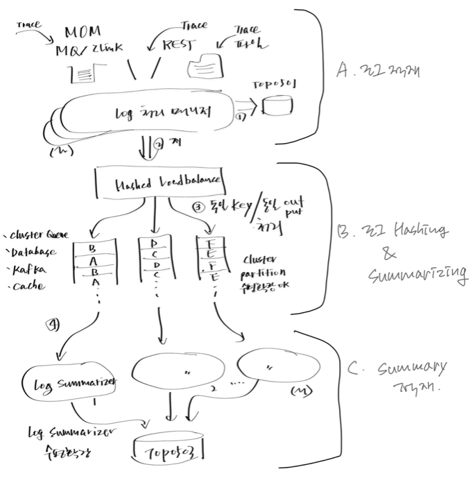

3.1.2 데이터 흐름 제어

로그 수집 시스템은 최종 레파지토리에 적재되기 전에 메시지의 파싱 및 변환을 처리하고 상태값을 유지해야 하는 등 데이터 스트림을 처리하는 과정을 수반하게 되는데 이때 데이터의 흐름을 효과적으로 제어하기 위한 방법과 필요하다면 잘 만들어진 솔루션 사용을 검토해 보아야 함니다.

텍스트만으로는 설명이 부족하니 일단 그림을 보고 추가 설명을 해보도록 하겠습니다.



A 로그적재 부분에서는 MQ, REST 서비스 프로바이더, 파일 등 다양한 입력 채널로부터 수집한 로그를 테이블에 적재하기 위해 파싱 및 표준 형식으로 변환하는 과정이 따르게 됩니다.

B 로그해싱 및 Summarizing 부분에서는 파티셔닝된 디스크에 해시함수를 사용하여 로그 데이터 스트림을 병렬 처리 가능하도록 분배합니다. 이때 로그 데이터를 디스크에 균등하게 분산하기 위해 해시함수를 이용합니다. 아울러 동일 거래로 인식되는 송신/허브/수신 로그들이 각각 동일 해시키를 가지도록 하여 동일 파티션으로 라우팅되도록 하고 이를 이용하여 동일 디스크 파티션 상에 존재하는 로그 상태 값을 스트림 상에서 관리할 수 있게됩니다.

C Summary 적재 부분은 송신/허브/수신 로그들이 도착할 때마다 변경되는 상태정보를 최종 레파지토리 테이블에 반영하는 과정을 설명합니다.

정리하면,
```
    A 개별로그 적재 -> B 로그Summary 상태 변경 -> C 로그Summary 적재
```

---

다음은 개발 시스템의 오브젝트 구성에 대해 짚고 넘어가겠습니다.

다음 : [오브젝트구성](P01-3-1-3-오브젝트구성.md) 
