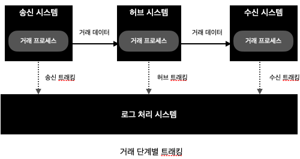
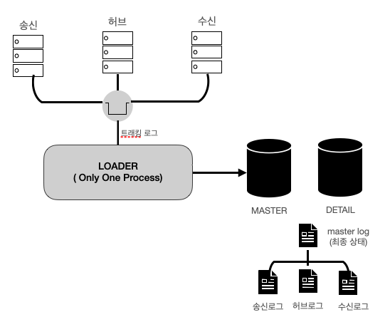
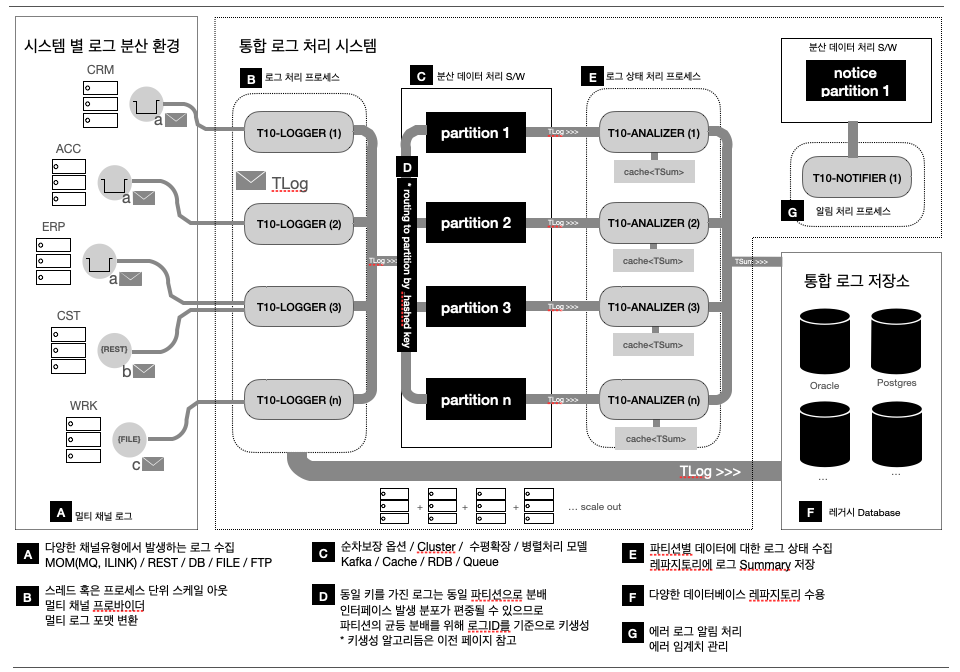

개발할 시스템의 간략한 요구사항을 정리해 보면 다음과 같습니다.


[ 요구 사항 ]
``````
1) 하나의 거래는 복수의 프로세스 처리로 이루어진다. 예) 송신->허브->수신 
2) 거래를 처리하는 각 단계의 프로세스는 개별적인 트래킹 로그를 발생시킨다.
3) 로그처리 시스템은 각 단계별 프로세스의 로그를 수집하여 특정 테이블에 적재한다.
4) 송신 허브 수신 각 단계별로 수집된 로그에서 거래의 최종 처리 상태를 확인할 수 있도록 요약 정보를 생성하여 적재한다.
``````

위의 요구사항을 그림으로 표현하면 다음과 같습니다.



트래킹 메시지 내용에 대해서는 아직 언급하지 않겠습니다. 트래킹 메시지 발생 구조에 집중하여 시스템 설계를 진행해 봅시다.

우선 새롭계 설계할 시스템의 걔선 포인트를 찾기위해 기존 처리 방식을 간략히 설명하고자 합니다.

아래 그림에서와 같이 기존 처리 방식은 시스템 차원에서 접근했다기 보다는 트래킹 로그를 처리하는 기능적 측면에서만 고려하고 있어서 양적 측면과 기능적 측면 모두에서 확장을 고려하기엔 부족한 모습입니다.



아쉬운 점을 몇가지 들자면 아래와 같습니다.
```
    - 로그수집은 큐를 통해서만 가능
    - 멀티 스레드/프로세스 미지원(병렬처리 불가능)
    - 최종 로그 저장 구조가 마스터-디테일 구조로 마스터가 우선 처리되어야 하는 구조
```
결론적으로는 기존 구조로는 좀 더 다양하고 좀 더 많은 양의 로그 수집이 가능하도록 시스템을 확장할 수 없다는 결론입니다.

기존 로그처리 방식에서 개선점을 찾아 본다면 다음과 같이 정리해 볼 수 있을 것 같습니다.

```
    - H/W 확장에 따른 시스템(로그처리 S/W) 확장가능
    - 다양한 로그 채널 허용 
    - 대량 데이터 처리
    - 트래킹 로그 활용
```

아래는 개선점을 고려한 초기 아키텍처 모습입니다.



위 아키텍처에서는 구체적으로 다음 포인트를 목표로 하고 있습니다.

```
    1) 다양한 채널로 로그 수집
    2) 다양한 형식의 로그 수집
    3) 동시처리 및 수평확장 스트림데이터 파티셔닝 지원
    4) 로그 저장 레파지토리의 다양성 보장
    5) 알림 등 로그 활용성 확대
```

1) 다양한 채널로 로그 수집 

    기존에 IBM Websphere 의 큐를 통해 EAI 인터페이스를 구축해 오던 환경에서 자연스럽게 로그 수집 또한 큐를 통해 로그 이벤트를 쌓고 처리하는 방식이었다면,
    새로운 아키텍처에서는 기존의 큐를 포함 REST 서비스 프로바이더 및 파일 등 다양한 형태의 입력 로그를 처리할 수 있는 입력 채널 다변화를 지원할 수 있으면 좋겠습니다.

2) 다양한 형식의 로그 수집

    입력 채널의 방식에 따라 수집되는 로그의 형식이 달라짐에 따라 로그 시스템 내부에서
    다루어야 하는 형식도 다양해지므로 로그시스템 내부에는 슈퍼셋 형태의 표준 형식을 정하고 채널별로 다양한 형식을 수집시점에 표준로그로 파싱하면 좋겠습니다.

3) 동시처리 및 수평확장 스트림데이터 파티셔닝 지원

    아무리 성능이 뛰어난 서버도 거래가 지속적으로 증가하면 특정 시점에는 임계 성능에 도달하게 되고 이 시점에는 서버증설을 고려하게 됩니다. 하지만 시스템 아키텍처가 성능 향상을 위해 서버증설을 지원할 수 없는 구조라면 큰 문제에 직면하게 됩니다. 따라서 설계 단계에서부터 동시처리 및 H/W, S/W 측면 모두 수평확장이 가능하도록 고려한다면 좋겠습니다.

4) 로그 저장 레파지토리의 다양성 보장

    최근에는 로그를 저장하는 레파지토리도 그 활용 목적에 따라 다양해 지고 있는 추세입니다. 고전적인 RDB 시스템 뿐만 아니라 NoSQL DB 등을 포함하여 다양한 종류의 레파지토리를 지원하면 좋겠습니다. 

5) 알림 등 로그 활용성 확대

    기존에 EAI는 기업 내부의 시스템을 연계하는 용도로 국한하여 내부연계를 통해 발생되는 로그는 인터페이스가 잘 수행되었는지 판단하거나 EAI 시스템의 헬스체크 모니터링 용도로 활용되는 것이 전부였습니다. 
    
    하지만 내부 시스템 로깅에만 그치지 않고 통합로그 시스템으로 확장한다면 여러 측면에서 로그의 활용을 고려해 볼 수 있습니다. 
    
    예를 들자면 오픈마켓을 운영하는 시스템이라면 실시간으로 발생하는 로그 스트림 상에서 특정 고객의 지역별 시간대별 소비패턴 등의 유용한 정보를 가공하여 상품추천 캠패인 시스템의 입력자료로 활용할 수 있겠습니다.

