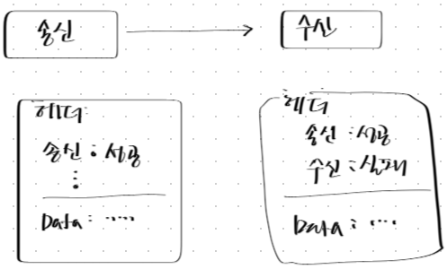
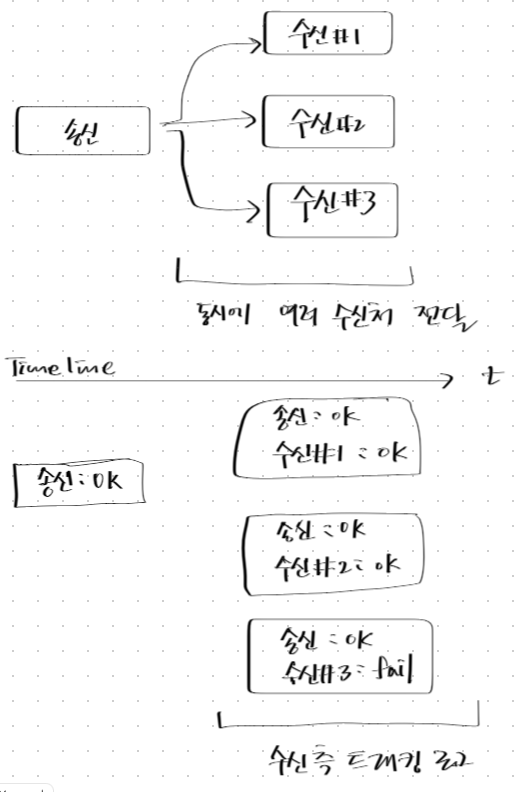

3.2.1 메시지 설계

각 채널에서 수집되는 로그 메시지의 모양은 다양하므로 로그시스템 안에서 해들링되는 메시지의 형태를 하나의 표준화된 형식으로 통일한다면 애플리케이션 개발 시 복잡도를 줄일 수 있게됩니다.

이이를 위해서 표준 메시지를 정의해 보겠습니다.
일단 메시지의 도메인은 EAI 로그(트래킹) 시스템에 사용된다는 전제하에 설계를 진행합니다.

[필수 항목]

AS-IS 트래킹로그 컬럼을 모두 포함합니다.

*표 표시는 필수값을 의미합니다.
```
*  1) 호스트 ID
*  2) 인터페이스 ID
*  3) 메시지 DATE (YYYYMMDDHH24MISSssssss)
*  4) 프로세스 ID
*  5) 프로세스 DATE (YYYYMMDDHH24MISSssssss)
*  6) 프로세스 TYPE ( 송신, 허브, 수신 )
*  7) 상태 (성공, 에러)
*  8) 수신노드 개수
*  9) 노드 증가값 
  10) 타임존 
  11) 이전호스트 ID
  12) 이전프로세스 ID
  13) OS
  14) IP
  15) 에러코드
  16) 에러메시지
  17) 레코드건수
  18) 데이터사이즈
  19) 압축구분
  20) 거래데이터
```
현행 시스템에서 발생되고 있는 로그는 위의 컬럼을 포함하고 있으며 새로운 시스템에 추가할 컬럼을 추가하여 새로운 메시지 형식을 설계하도록 하겠습니다.

위 필수 항목을 기준으로 데이터셋을 정의해 보면 다음과 같습니다.

| id                | nm    |
|        :---       | :--- |
| id                | 아이디 |  
|	integrationId     | 인터페이스 ID |
|	originHostId      | 발생지 호스트 ID |
|	date              | 인터페이스 발생일시 |
|	processId         | 실행 프로세스 ID  |
|	processDate       | 실행 시작 시간 |
|	processEndDate    | 실행 종료 시간 |
|	timezone          | 타임존 |
|	elapsedTime       | 실행시간 |
|	type              | 유형(송신,허브,수신) |
|	seq               | 순번 |
|	previousHostId    | 이전 호스트 ID |
|	previousProcessId | 이전 프로세스 ID |
|	hostId            | 현재노드 프로세스 ID |
|	os                | os |
|	ip                | ip address |
|	status            | 처리상태(완료, 실패) |
|	errorCode         | 에러코드 |
|	errorMessage      | 에러메시지 |
|	recordCount       | 처리레코드건수 |
|	dataSize          | 처리데이터사이즈 |
|	compress          | 압축구분 |
|	app               | 애플리케이션명 |
|	data              | 데이터 |
|	todoNodeCount     | 처리할 수신노드 개수 |
|	regId             | 등록 ID |
|	regDate           | 등록일시 |


좀 더 확장하여  거래가 진행될 때마다 노드별 트래킹 메시지를 누적하여 처리하는 구조 즉 거래를 실행하는 애플리케이션에서 이전 노드에서 처리하는 로그의 정보와 상태를 업데이트여 다음 노드로 전달하는 구조를 갖게된다면 로그를 처리하는 로그시스템에서는 별도의 Summary 작업을 수행하지 않아도 됨으로 부담을 줄일 수 있습니다.

그런데 누적 구조의 트래킹 메시지를 처리할 때 한 곳으로만 메시지를 전송하는 거래 외에 동시에 다수의 수신처로 전송하는 경우도 고려해 보아야 합니다. 이경우 거래 형태는 비동기 방식입니다.
동기 방식일 경우 수신처리 성공여부를 송신 측에서 대기하여 확인할 수 있는 경우이니 논외로 하겠습니다.

텍스트로만 설명하기엔 다소 복잡한 감이 있으므로 간략하게 그림을 그려보았습니다.

수신노드가 하나인 경우는 비동기 방식의 거래일 경우라도 데이터와 함께 트래킹정보를 헤더에 넣어 전달 가능하므로 로그상태정보를 누적하여 전달 가능합니다. 



하지만 동시에 여러 곳에 같은 데이터를 전송하는 경우에는 각 수신노드는 동일 시간선상에서 처리되는 이웃 수신 측의 처리 상태를 알 수 없어 결국 로그를 최종 처리하는 시스템에서 3개의 수신 노드 트래킹을 모아서 업데이트 해야만 하는 경우가 발생됩니다.



결국 동기/비동기 처리 방식을 떠나 근본적으로 로그를 좀더 구조화하여 로그를 처리하는 시스템에 부담을 줄여주기 위해서는 거래를 실행하는 프로세스에서 최종로그를 종합하여 로그 시스템에 전달하는 방식을 고려해보는 것도 한 방법이겠습니다. 이를 테면 아래와 같이 말입니다.


---
[message key]

  * hostname + UUID 

[message structure]

  * 헤더
      ```
      - service id(interface id, integraion id, ....)
      - msg key (uuid)
      - create time
      - host name
      - caller id
      - target address list
      - transfer method
      - caller type (request, hub, response, ...)
      - sync
      ```
  * 바디
      ```
      - data format
      - data length
      - data character set
      - data
      ```
[service type simulation]

거래유형을 시뮬레이션하여 설계된 메시지가 대부분의 거래를 만족시킬 수 있을지 판단해 봅니다.


